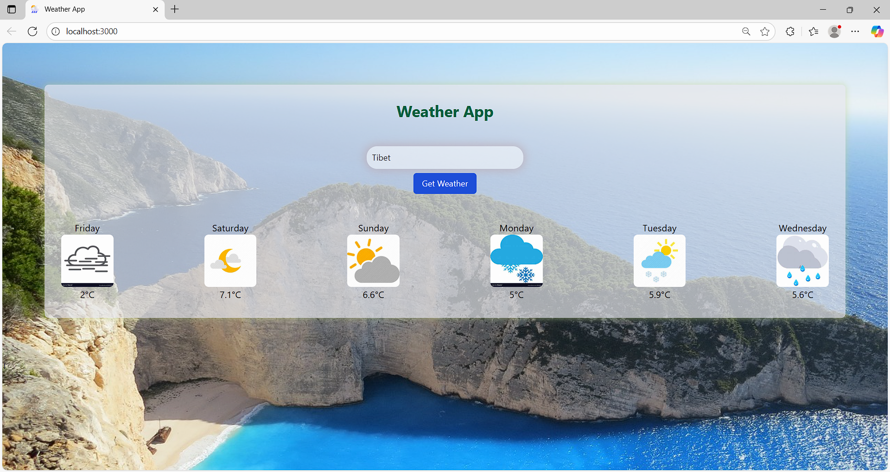

# 🌦️ Horizon-Weather — Real-Time Weather Forecasting with Node.js & Express.js

A web application that provides real-time and location-based weather forecasts using the **Tomorrow.io API**. Built with **Node.js** and **Express.js**, it offers a user-friendly and responsive interface for easy access to weather data.

---

## 🌐 Live Demo

You can experience the interactive website live here: [**🌦️Horizon-Weather**](https://dhanush-krishna-horizon-weather.onrender.com)

---

## 🚀 Features

- **Real-time Weather Data**  
  Integrates with the Tomorrow.io API to fetch accurate and up-to-date weather forecasts for locations worldwide.

- **Location-Based Forecast**  
  Users can input any city or country to receive tailored weather forecasts specific to that area.

- **Comprehensive Weather Display**  
  Displays temperature, humidity, and general weather conditions in a clean and visual format for better readability.

- **User-Friendly Interface**  
  Designed with responsiveness in mind, ensuring a smooth experience across devices like desktops, tablets, and mobiles.

---

## 🛠️ Tech Stack

### 1. Backend:

  - **Node.js:** The JavaScript runtime environment for building the server.

  - **Express.js:** A fast, unopinionated, minimalist web framework for Node.js, used to create the server and handle API requests.

  - **Axios:** A promise-based HTTP client for making API calls from the backend to the Tomorrow.io service.

  - **CORS:** A Node.js package that provides a middleware to enable Cross-Origin Resource Sharing.

  - **dotenv:** A zero-dependency module that loads environment variables from a .env file, keeping sensitive data like your API key secure.

### 2. Frontend:

  - **HTML:** Provides the structure of the web page.

  - **CSS:** Used for custom styling to give the app a unique look and feel.

  - **Tailwind CSS:** A utility-first CSS framework for rapidly building custom designs.

  - **JavaScript:** Handles all client-side logic, including fetching data from the backend and dynamically updating the UI.

---

## 📸 Screenshots

### 🌤️ Home Interface  


### 📈 Weather Result Display  


---

## 🎬 Demo Video

📺 Click below to **watch/download the full project demo**:

➡️ [View Full Demo](assets/demo/Full_Demo_Weather_Project.mkv)

---

## ⚙️ How It Works

### The application follows a client-server architecture:

  **1. User Input:** The user enters a city name into the input field on the index.html page and submits the form.

  **2. Frontend Request:** The JavaScript code on the frontend sends a GET request to the backend server's /weather endp**oint, passing the city name as a query parameter.

  **3. Backend Processing:** The Node.js server (script.js) receives the request. It uses the city name and the API key (from the .env file) to make a request to the Tomorrow.io weather API.

  **4. Data Formatting:** The server then processes the raw data received from the external API, extracting and formatting the key information (time, weather code, temperature, and humidity) into a clean JSON
                         response.

  **5. Data Display:** The backend sends the formatted JSON data back to the frontend. The frontend's JavaScript receives this data and dynamically updates the index.html page to display the weather forecast for
                      the next few days.
                      
---

## 🔮 Future Enhancements

- User authentication

- Personalized weather dashboards

- Historical weather data analysis

- Real-time weather alerts

---

## 🚀 Getting Started

To get a local copy up and running, follow these simple steps.

### Prerequisites
   - Node.js (LTS version recommended)
   
   - npm (comes with Node.js)
   
   - A Tomorrow.io API key (get one from the official Tomorrow.io website)

### Installation

**1. Clone the repository:**

```bash
git clone https://github.com/DhanushKrishna07/horizon-weather.git
cd horizon-weather
```

**2. Install npm packages:**

```bash
npm install
```

**3. Set up environment variables:**
Create a .env file in the root directory of your project and add your API key:
```bash
API_KEY=your_tomorrow_io_api_key_here
```

### Running the Application
**1. Start the backend server:**

```bash
npm start
```
or
```bash
node script.js
```
The server will start on http://localhost:3000.

**2. Access the Application:**
Open your web browser and go to http://localhost:3000. This will load the index.html file that is being served by your Express.js server and allow the frontend to communicate with the backend.

**3. Use the App:**
Enter a city name in the search box and click "Get Weather" to see the forecast.
